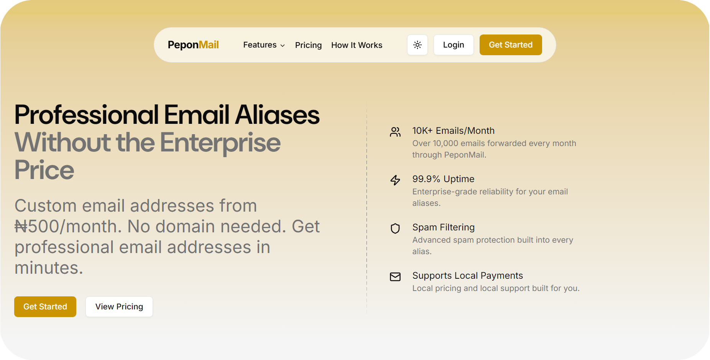

# PeponMail

Professional email aliases for businesses and individuals. Create custom email addresses without buying a domain — starting from ₦500/month or $0.50/month.



**Live:** [peponmail.com.ng](https://peponmail.com.ng) · [peponmail.com](https://peponmail.com)

---

## Getting Started

```bash
npm install
npm run dev
```

Open [http://localhost:3000](http://localhost:3000) in your browser.

---

## Tech Stack

- **Next.js 15** — App Router, server components, middleware
- **TypeScript** — Full type safety
- **Tailwind CSS 4** — Styling
- **shadcn/ui** — UI components
- **React 19**
- **web-haptics** — Haptic feedback on all interactions
- **React Hook Form + Zod** — Form validation
- **Recharts** — Email stats dashboard chart
- **next-themes** — Dark/light mode

---

## Features

- **Email aliases** — Shared and custom domain plans
- **Dashboard** — Manage aliases, domains, mail, and settings
- **Regional pricing** — Automatically shows NGN (₦) on `.com.ng`, USD ($) on `.com`
- **Dark/light mode** — System-aware with manual toggle
- **Haptic feedback** — On all buttons, links, accordions, and scroll
- **Responsive** — Mobile-first, with mobile-specific hero images
- **SEO** — Full OpenGraph/Twitter meta with custom preview image

---

## Pages

| Route | Description |
|-------|-------------|
| `/` | Landing page |
| `/pricing` | Pricing plans |
| `/faq` | Frequently asked questions |
| `/contact` | Contact form |
| `/login` | Sign in |
| `/signup` | Create account |
| `/onboarding` | Domain & wallet setup |
| `/dashboard` | App — aliases, domains, mail, settings |
| `/about` | About PeponMail |
| `/terms` | Terms & Conditions |
| `/privacy` | Privacy Policy |

---

## Regional Pricing

Pricing is served automatically based on the domain the site is accessed from:

| Domain | Currency | Shared Plan | Custom Plan |
|--------|----------|-------------|-------------|
| `peponmail.com.ng` | Nigerian Naira (₦) | ₦500/alias/mo | ₦1,000/alias/mo |
| `peponmail.com` | USD ($) | $0.50/alias/mo | $1.00/alias/mo |

This is handled via Next.js middleware that reads the `host` header and sets an `x-region` response header, which server components read via `headers()`.

---

## Deployment

Deployed on [Vercel](https://vercel.com) with both `peponmail.com` and `peponmail.com.ng` custom domains.

